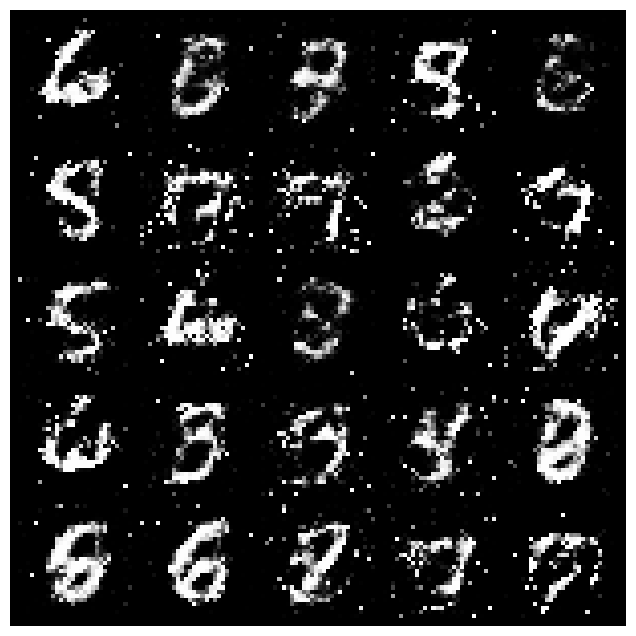

# gan experiments
tried implementing gans, cgans and feature matching. here is what happened:

### 1. vanilla gan
Implemented simple generator and discriminator (mlp)
**Result:** trained pretty fast on mnist. digits look okay, maybe a bit fuzzy but recognizable. mode collapse didn't seem to be a huge issue with batchnorm

### 2. conditional gan (cgan)
added class labels (embedding) to both g and d.
**Result:** now i can request specific digits. works surprisingly well. fashion-mnist classes also generated correctly (dresses, sneakers etc)

### 3. feature matching problem
implemented feature matching to stabilize training.
**problem:** initially the generated images turned into pure noise. d loss was dropping to 0 too fast, so g stopped learning:

**solution:**
- reduced discriminator learning rate (0.0002 -> 0.0001)
- added noise to discriminator inputs
- used deeper layer for feature matching
**result:** after tuning, images are recognizable again, though still have some artifacts. stable training is hard

## Conclusion
gans are definitely harder to train than vaes:
- **instability** - loss curves jump around a lot
- **tuning** - had to tweak lr and add noise to make feature matching work
- **quality** - when it works, images are sharper than vae, but getting there is painful

