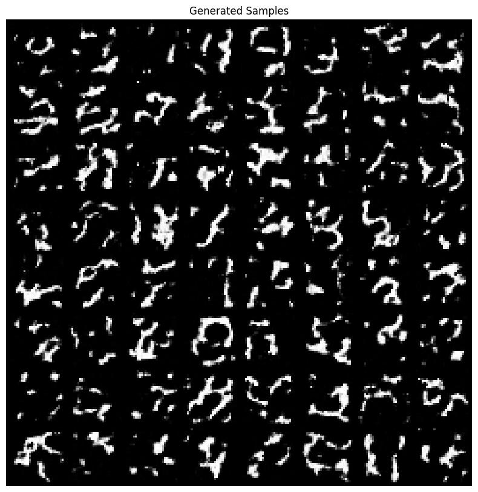
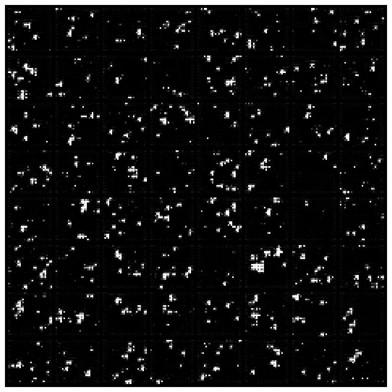
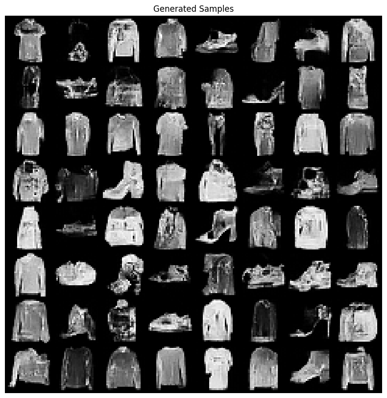
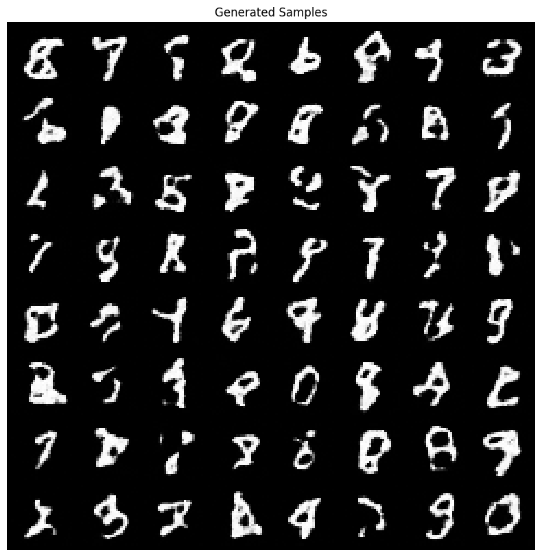

# Normalizing Flow: RealNVP on MNIST

This part of the homework was about implementing RealNVP and training it to generate MNIST digits and fashion images. Here is a short summary of what I tried, what failed, and what finally worked.

### 1. Basic RealNVP
I started with a simple implementation:
- 4 coupling layers per scale
- Simple 3-layer CNN inside each coupling layer
- `ReLU` activations

**Result:** Not great. The generated samples looked like alien hieroglyphs or just random noise dots. The model learned local textures (lines) but couldn't form global shapes (digits)

### 2. Adding batch normalization
I thought adding Batch Norm inside the coupling layers would stabilize training.

**Result:** It actually made things worse. The images turned into scattered dots. It seems Batch Norm doesn't play well with the flow architecture when the batch size is small or when the statistics fluctuate too much.

### 3. Tuning hyperparameters (scaling up)
Then I tried to just make the model bigger:
- Increased width (channels) from 64 to 128.
- Increased depth (layers) from 4 to 8.
- Added `Weight Normalization` and learnable scaling (`tanh * scale`) to stabilize the outputs.
- Added Channel Shuffling (permuting channels) to mix information better.

**Result:** Better! The "dots" turned into mycelium-like structures (thin connected lines). It started to look like a very bad handwriting, but still not quite like digits. The model was learning topology but struggled with structure.

### 4. Final architecture
Finally, I decided to significantly increase the model's capacity to "memorize" and learn complex patterns:
- **ResNet Blocks**: I replaced the simple CNN in coupling layers with deep ResNet blocks (3 blocks per layer).
- **Capacity**: This increased the effective depth to over 50 convolutional layers.
- **Optimization**: Used `CosineAnnealingLR` to fine-tune the weights at the end of training.

**Result:** This worked. The training was slower, but the model finally started generating recognizable digits instead of random squiggles. It could look even better but I unfortunatelly didn't have enough computational resources to train it for longer (100+ epochs).

## Conclusion
RealNVP is tricky. Simple architectures don't really work for image generation even on simple datasets like MNIST.
You need a lot of time and patience to train the model and of cource a lot of computational resources.