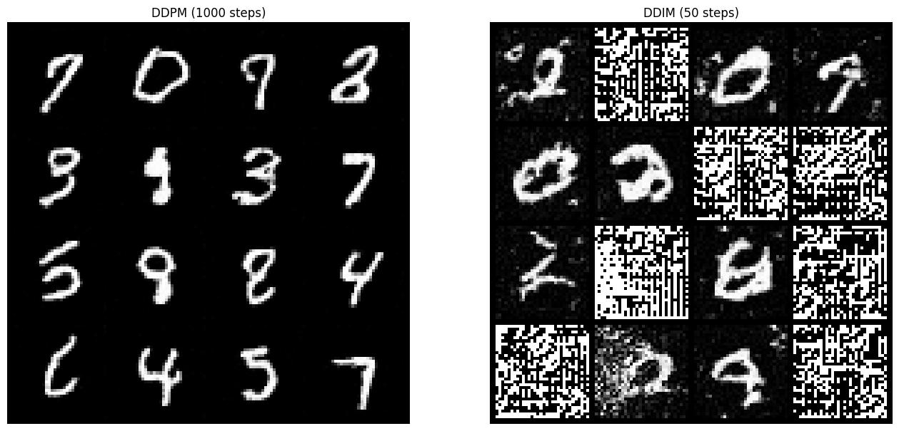
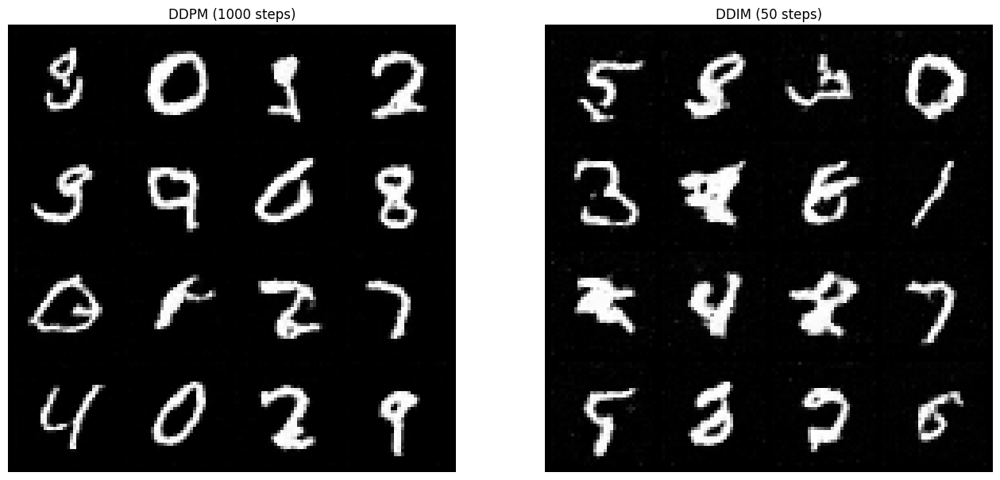
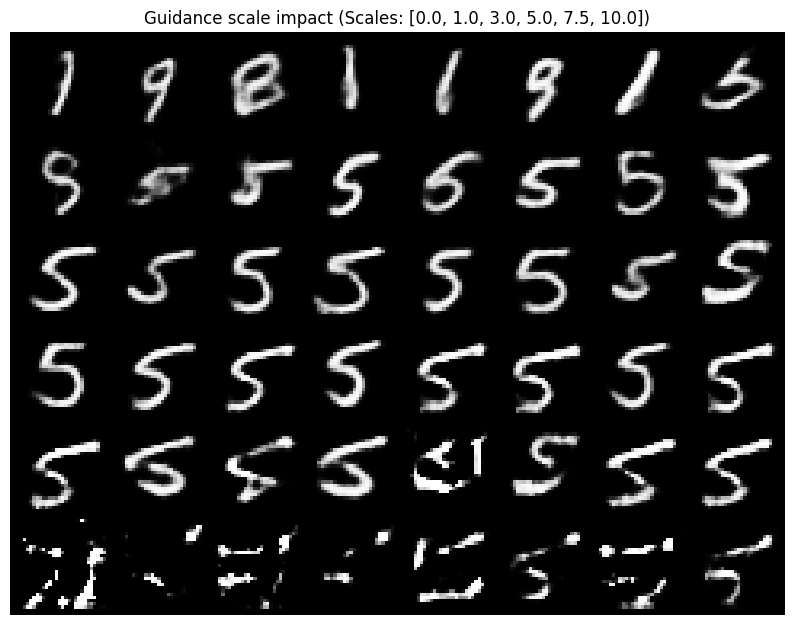
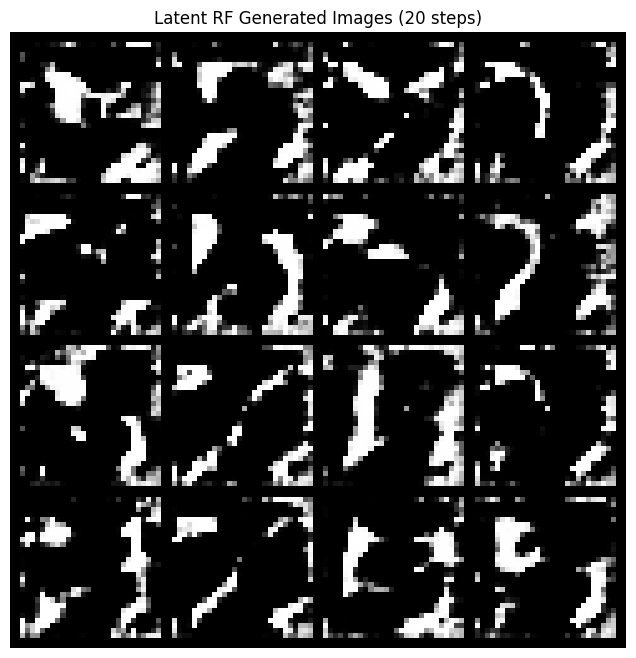
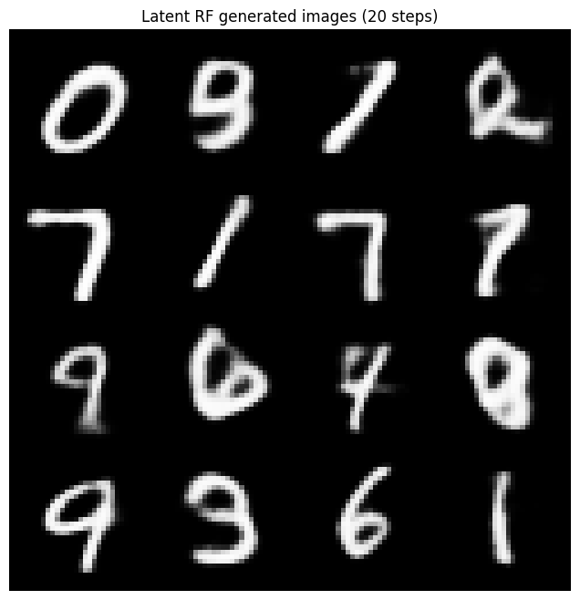

# Diffusion models experiments (mnist)

This repository contains my implementations of various generative models trained on the mnist dataset. The goal was to progress from standard diffusion (ddpm) to more efficient methods (ddim, latent diffusion) and finally to rectified flow.

Project structure:
```
homework_2/
├── 1_ddpm_ddim_mnist.ipynb        # pixel-space ddpm & ddim
├── 2_latent_diffusion_cfg.ipynb   # latent diffusion + classifier-free guidance
└── 3_rectified_flow.ipynb         # rectified flow (pixel & latent)
```

## 1. DDPM & DDIM (pixel space)

I started by training a standard u-net on 32x32 mnist images. The model predicts the noise added to the image at each timestep.

**Experiments & Observations:**
training was stable (mse loss), but sampling was the main challenge.
- **ddpm (1000 steps):** produces very sharp and diverse digits, but it's painfully slow. generating a batch takes significant time because we have to iterate through the full markov chain.
- **ddim (50 steps):** the goal was to speed this up. ddim skips steps, theoretically allowing us to generate images 20x faster.

**QR-like artifact problem:**
my first ddim implementation failed mostly. the images looked like noisy qr codes or alien symbols—high contrast black-and-white grids.
after debugging, i realized the issue was in the reconstruction step. ddim takes large steps, and early in the process, the predicted "clean image" ($x_0$) often has values way outside the valid range $[-1, 1]$



**Fix:**
I modified the sampler to clip the predicted $x_0$ to $[-1, 1]$ *before* re-calculating the noise direction. This stabilized the trajectory completely. Now ddim-50 produces results almost identical to ddpm-1000:



## 2. Latent diffusion & CFG

Next I moved the diffusion process into the latent space of a vae.

Diffusion on pixels is expensive. By compressing the image into a small vector, we can train much faster. I used a simple convolutional vae that compresses 28x28 images into a 20-dimensional vector.
Since the input is now just a 1d vector, I replaced the heavy u-net with a lightweight residual mlp. Training takes minutes instead of hours.

**Classifier-free guidance (cfg):**
I implemented cfg to control which digit gets generated:
- during training, i drop the class label 10% of the time (replace it with a "null" token)
- during sampling, i predict noise twice: once with the label, once without
- the final prediction is a weighted sum: $\epsilon = \epsilon_{uncond} + w \cdot (\epsilon_{cond} - \epsilon_{uncond})$

**Findings:**
A guidance scale ($w$) of around 3.0 gives the best results:
- $w=0$: generates random digits (unconditional)
- $w=3$: generates the requested digit reliably
- $w>10$: the images start looking "fried" or over-saturated



## 3. Rectified flow

Finally I implemented rectified flow, which is a newer alternative to diffusion. Instead of a curved diffusion path, it learns a straight line from noise to data.

**Pixel vs latent RF:**
- **pixel space:** learned to generate digits, but training was slower compared to the latent version
- **latent space:** extremely fast. Since the trajectory is straight, i could use a simple euler solver with just 10-20 steps

**Critical bug I hit:**
When i first ran the latent rectified flow notebook, the output was pure noise. It turned out the issue was the vae. The script was initializing a new, random vae instead of loading the pre-trained one. So the latent vectors were just random projections of digits, and the decoder was outputting garbage:



Once fixed, the rectified flow model started generating perfect digits in just 10 steps.

**Conclusion:**
Rectified flow seems like the winner here. It's conceptually simpler (just predicting velocity $v = x_1 - x_0$) and requires far fewer sampling steps than even ddim:


